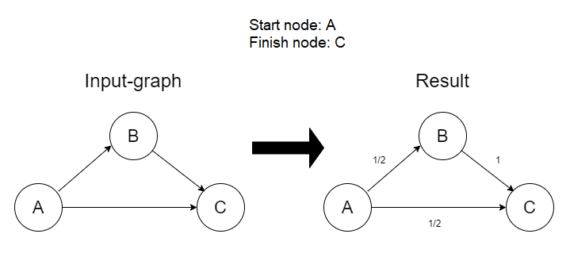

# equiprobable paths at graphs
 


- [Installation](#anc1)
- [Usage](#anc2)
- [Contribution](#anc3)
- [How it work](#anc4)
- [License](#anc5)

---

 Solving the problem of equiprobable paths at graphs using posterior probability assignments.

<a id="anc1"></a>

## Installation
- The sources of project can be downloaded from the [Github repo](https://github.com/rrtty0/equiprobable_paths_at_graphs.git).

* You can either clone the public repository:
```
        $ git clone https://github.com/rrtty0/equiprobable_paths_at_graphs.git 
```
<a id="anc2"></a>

## Usage

[Equally_prob_paths.cpp](./equally_prob_paths/Equally_prob_paths.cpp) contains source code for solving the problem of equiprobable paths at graphs. [Input.txt](./equally_prob_paths/input.txt) - is file, which stores data about input-graph. [Output.txt](./equally_prob_paths/output.txt) contain result of work solving the problem of equiprobable paths at input-graph.

<a id="anc3"></a>

## Contribution
1. _Clone repo_ and _create a new branch_:
```
        $ git clone https://github.com/rrtty0/equiprobable_paths_at_graphs.git
        $ git branch name_for_new_branch
        $ git checkout name_for_new_branch
```
2. _Make changes_ and _test_
3. _Submit Pull Request_ with comprehensive description of changes

<a id="anc4"></a>

## How it work

Let the input be a directed graph and two of its vertices. Solving the problem of equiprobable paths in a graph means assigning to each edge of the graph a number that characterizes the probability with which we will go along this edge being at the vertex from which this edge exits, following the path from predetermined initial and final vertices.

Example of work:




<a id="anc5"></a>

## License
Source Available License Agreement - [GNU v3.0](./LICENSE).